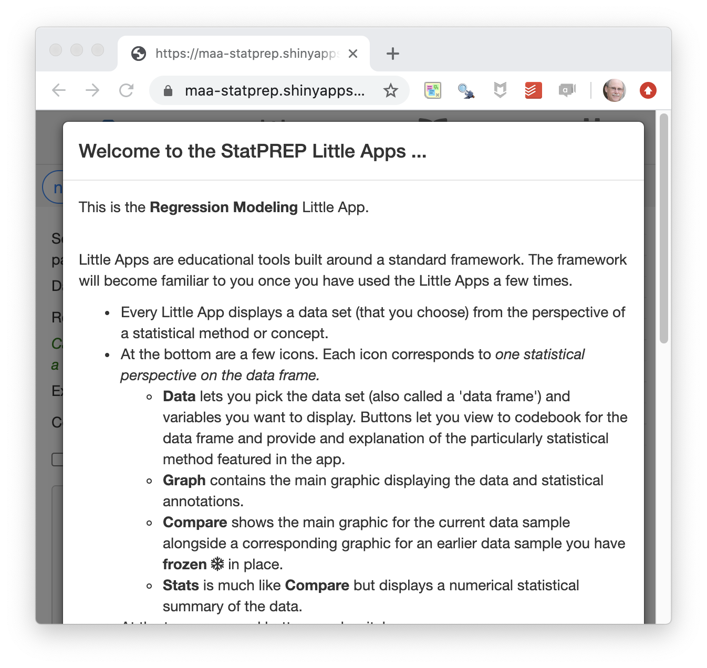
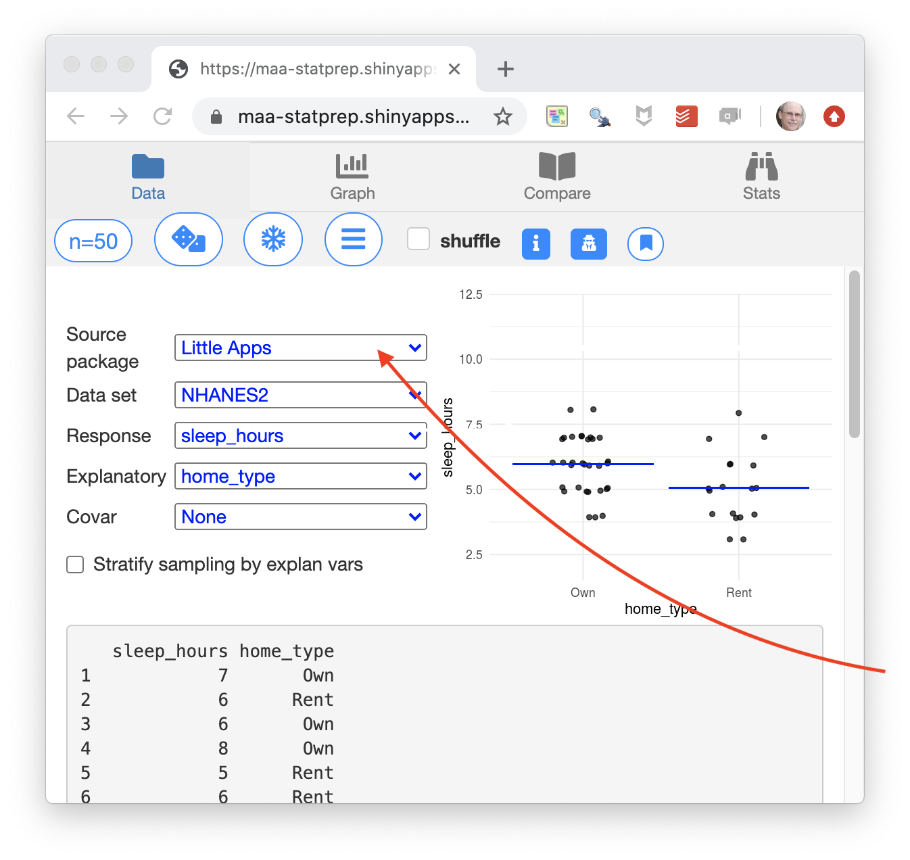
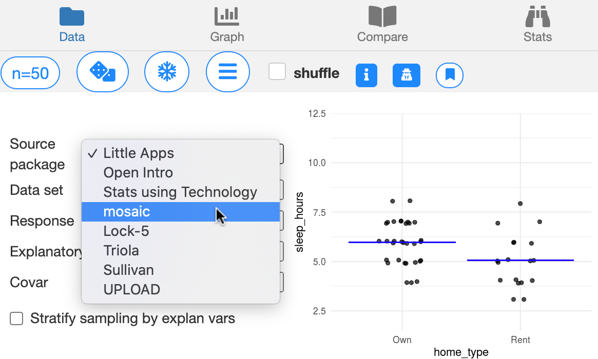
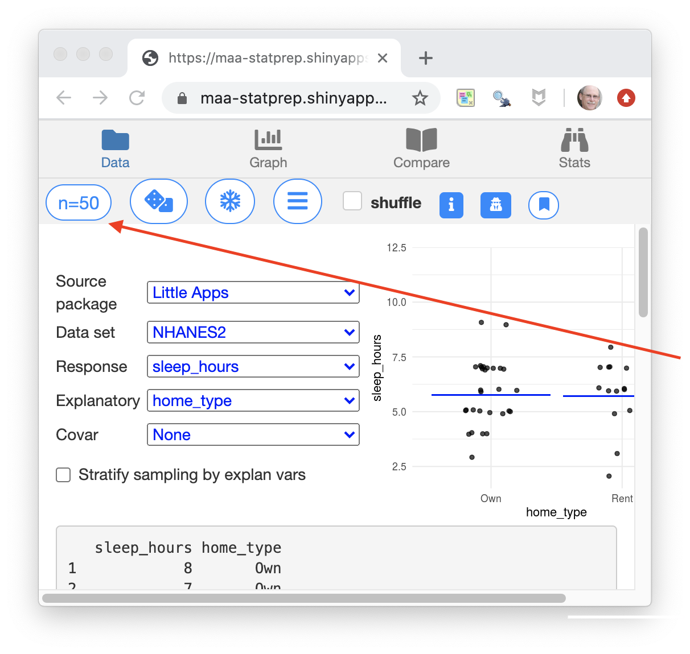
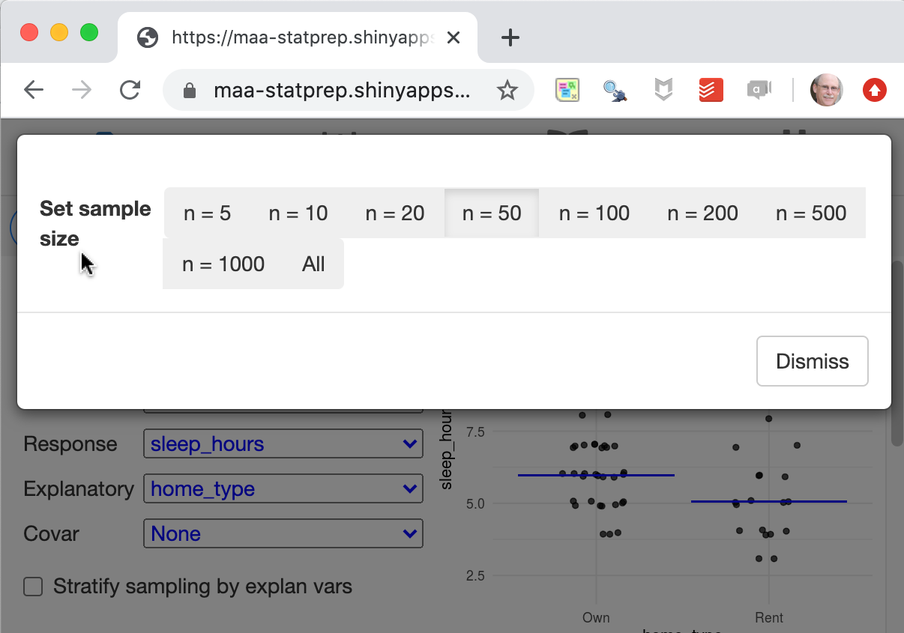
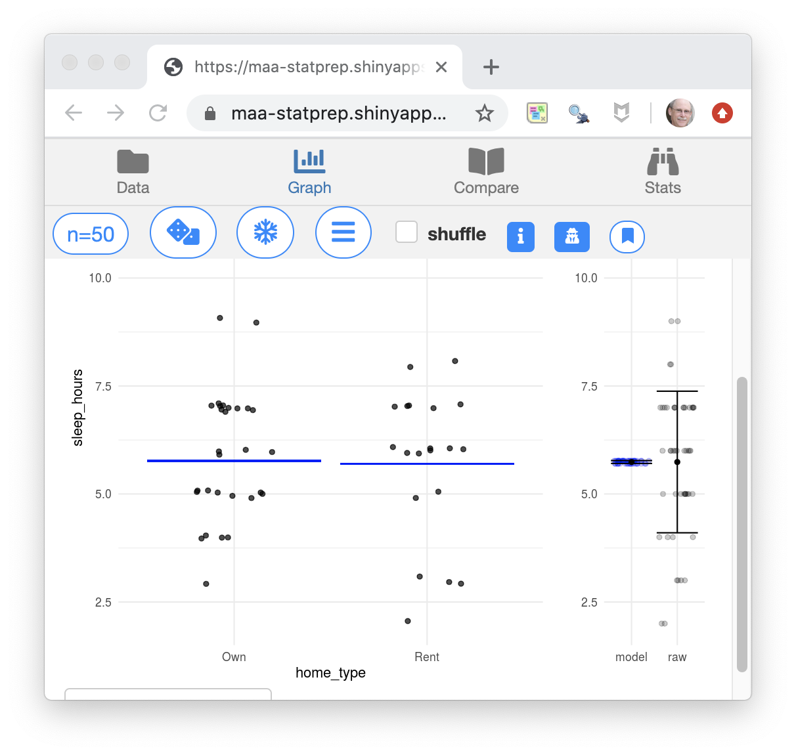

```{r setup, include=FALSE}
knitr::opts_chunk$set(echo = FALSE)
```

## Two central ideas from statistics

1. It's useful to think of abstract descriptions as reality, e.g. the idea of *crime rate*. 1830s, Adolphe Quetelet.
   - Remains somewhat stable across time.
   - Differences (between regions) stable across time.
    
2. Value of using randomness.
    * In controlled experiment, random assignment
    * In studying things of too great extent to observe in whole, observe a random sample

## The canonical curriculum

I'll boil it down to two central questions and the apparatus that lets us address them:

1. Are two proportions/means different?
2. Are two quantitative variables connected?

These two questions are sufficient to illustrate the two central ideas, e.g.

- Has the crime rate changed? 
- Are two regions different?
- Did the experimental intervention influence the outcome?
    
## What's left out of the canonical curriculum

a. How do we properly explore data to discover new patterns?
b. How do we deal with confounding in exploring relationships?
c. How do we make predictions/classifications?
d. How do we manage masses of data?

* These are central questions/skills of the data-driven workplace.*

## Possible objection

*"I disagree. Our courses do include those things.*"

My methodology to demonstrate the objection is mistaken:

- Show simple and widely used techniques for addressing the four questions that are not even mentioned in the canon.
- Show how we encourage students to abstain from addressing these questions.

> a. How do we properly explore data to discover new patterns?

- Do we teach about training versus testing data?
- Do we teach about correcting for multiple comparisons or researcher degrees of freedom?
- Do we teach about modern data graphics?Instead, histograms, box-and-whisker plots, even stem-plots.
- Do we teach about modern pattern-discovery techniques, e.g. cladistics and trees?

> b. How do we deal with confounding in exploring relationships?

- Do we teach about stratification?
- Do we teach about statistical adjustment?
- Don't we insist that only experiment can support causal claims? Do we distinguish sharply between a "statistical" relationship and a "causal" relationship? Can't statistics address causality?

> c. How do we make predictions/classifications?

- Do we teach about *"prediction intervals"*?
- Do we mention *"classifiers"*?

> d. How do we manage masses of data?

- Do we use a computer in our class?
- Do we use mainstream software?
- Do we teach about data frames and relational database operations?

## A consensus for reform?

The [GAISE College Report](https://www.amstat.org/asa/files/pdfs/GAISE/GaiseCollege_Full.pdf) (2016) offers recommendations for change.

I've never heard anyone object to the recommendations in GAISE. 

Is it then a consensus?

## The "post p < 0.05 world"

This is more controversial, but it is hardly a fringe movement.

Have you ever met an intro stats instructor who says, "I'm going to try removing p-values from the center of my course?"

## Restating GAISE

Two of the co-authors of the GAISE report are among the speakers in this workshop: Allan Rossman and Jeffrey Witmer.

I'm going to restate the GAISE recommendations in terms that I think make its direction more clear. Perhaps this represents my reading too much into the words of the report. Allan and Jeffrey can be good resources for pointing to ways that my direction diverges from GAISE.

## GAISE verbatim

Recommendations appearing on page 3 of the [2016 GAISE College Report](https://www.amstat.org/asa/files/pdfs/GAISE/GaiseCollege_Full.pdf).

1. Teach statistical thinking.
    * Teach statistics as an investigative process of problem-solving and decision-making.
    * Give students experience with multivariable thinking.
2. Focus on conceptual understanding.
3. Integrate real data with a context and purpose.
4. Foster active learning.
5. Use technology to explore concepts and analyze data.
6. Use assessments to improve and evaluate student learning.

## Refactoring the GAISE points

I think this list might be more useful if it were re-factored. First, let's pull out the parts that are broadly applicable to many or even most teaching, regardless of the topic:

i. Pedagogy      
    a. Use assessments in both formative and summative modes.
    b. Student activity and self-directed investigation are effective tools for learning.
    
And then the statistics-specific recommendations

ii. About statistics
    a. Statistics is fundamentally about making appropriate sense of data with an eye toward communicating with decision makers.
    b. A century's experience has shown that real situations involve multiple variables and potential confounding, and multivariable statistical methods help deal with this complexity.
    c. Computing is central to statistics at many levels: acquiring and managing data, constructing mathematical representations ("models") that summarize data, displaying data and proposed summaries to inform decision makers.

## More boiled down still ...

Statistics is about ...

a. data 
b. displaying data and patterns genuinely evidenced by data
c. interpreting displays both to refine display choices and to inform decision makers.

## Or, perhaps too compactly,

Data. Displays. Patterns. Informing.

## A Data/Display/Pattern tool

I want to introduce you to a tool that was designed around this conception of statistics. The title of this presentation reflects the nature of this tool:

1. Multiple variables. 
    a. We know that displays of one or two variables are inherently limited and provide no means to address the important issue of confounding.
    b. Data with multiple variables provides a context where students can explore and compare multiple hypotheses. This supports "active learning" and "an investigative process of problem-solving and decision-making."

2. One method.
    a. We have a half-century of experience from teaching broadly statistics courses that introduce many, many methods. Hardly anyone remembers anything but the trauma of learning these methods and even highly educated decision-makers have confidence that they are accomplishing what's really needed.
    b. If statistics really were so complicated that a multiplicity of methods is needed to handle even routine problems, then of course we should be teaching the multiple methods. But there is in fact a single mathematical analytical process that underlies and unites all the methodological manifestations and that can handle all routine problems (including addressing confounding).

3. No login.    
What I want to say here (but with only six words for the whole title!) is
    a. Computers must be involved. This is statistics,  after all.
    b. But providing genuine and sophisticated computation is not just a software and hardware problem  (which has been solved), but an administrative problem of of giving ready access to students with the resources they and their instructors have and not relying on technical skills (e.g. programming) that mainstream students don't have training in.

The tool: a app for displaying data and patterns as well as their variation due to random assignment and random sampling.

Note that there are closely related tools  

## Wait a little ...

1. I'm going to lead a little demo of the tool for about 10 minutes.

    > Please refrain from using it yourself during this period. The question-and-answer period is a good time or you to play with it.
    
2. Then I'll spend 10 minutes on the aspirational part of this presentation: How to unify the canonical course's many methods into one basic method that extends naturally to more advanced use of statistics.

    > But for those of you who need to deal with tomorrow before moving on to something brand new ... I'll directly you to a set of tools, closely related to the one I'm going to show, that are designed around existing topics in the canonical curriculum, e.g. distributions, t-tests.
    
## A tool for exploring data

Making sense of data often involves a cycle:

a. Look at the data in some way that you think might be informative.
b. Consider the *pattern* shown by the data and figure out what makes sense and what remains mysterious to you.
c. Think about what might explain or illuminate the mystery.
d. Figure out how you might display the data in order to produce a better explanation. Then, back to (a).

The description of the cycle uses only everyday words. But there will be a lot to learn. For instance:

- What do we mean by "*pattern in the data*"?
- How can we know if a given pattern explains a lot about the data or just a little?
- How do we avoid reading a pattern into data that really isn't there? What does it mean to say, "really isn't there?"

You're going to be working with a tool for displaying data and patterns that will let you explore data as you think best. The tool is oriented around *learning statistics* so it includes features to explore some basic questions:

* What would happen if *more data* were available? How much data do we need to see a pattern clearly?
* Suppose there were no actual pattern in the data. Could we be tricked into seeing a pattern that isn't there? 

The tool is called a "Little App." You run it in an ordinary web browser, just by going to [this site](https://maa-statprep.shinyapps.io/Little_App_Regression/).

I'm going to show you how it works and then you'll be all set up to use it.

1. Opens with a splash page of instructions and explanations. You should read these. I'm going to be summarizing it now, so we'll just dismiss the splash page by clicking outside it.

```{r echo=FALSE, fig.align="center", out.width="50%"}

```
2. We start on a tab called "Data." This is where you choose a source of data and the variables you want to look at. For fun, the data set and the variables are selected at random at first, but you choose the ones you want.

```{r echo=FALSE, fig.keep="hold", out.width="50%"}


```

3. Since the amount of data is an important consideration in statistics, there's a control to let you look at just a little data or a lot of data.

```{r echo=FALSE, fig.keep="hold", out.width="50%"}


```

4. The graphic always shows both the data *and* a *pattern*. You have some control over the type of pattern that's being displayed. 
```{r echo=FALSE, fig.align="center", out.width="80%"}

```

The *pattern* here is shown by the blue lines in the left panel, which show the mean number of sleep hours for the different types of homes: rental versus owner-occupied. In this case, the home-owners seem to get a tiny, little more sleep on average, but tools of statistical inference would show that the pattern seen in a different sample could well be different.

The right panel is a tool for doing statistical inference, showing the variation in the number of sleep hours and the variation if all the data were condensed down to the appropriate blue line.


## Part II: One method for everything

[Follow this link](https://dtkaplan.github.io/remodeled-stats/posts/2020-06-28-inferencewithf/).

## Summing up

I'm recommending that we simply sidestep the many inferential methods presented in the canonical Stat 101.

Instead, show one method that covers *all* the canonical inferential settings as well as multivariate settings.

- Read [Jeff Witmer's editorial](https://www.tandfonline.com/doi/full/10.1080/10691898.2019.1702415) in the *Journal of Statistical Education*. It points to the utterly meaningless precision on which we waste so much time and effort in our classes. 
- A more complete explanation of the F method is given in the [Compact Guide to Classical Inference](https://dtkaplan.github.io/CompactInference).
- More Little Apps are available [here](https://statprep.github.io/LittleAppSite/).